# 02: Architecture

## System diagram

```mermaid
flowchart LR
  subgraph Clients
    A[Demo agent<br/>openai SDK + MCP client]
    X[Any OpenAI-compatible agent]
  end

  subgraph GW[AgentGuard gateway: FastAPI :8000]
    L[/v1/chat/completions<br/>LLM Gateway/]
    M[/mcp/&#123;server&#125;<br/>MCP Proxy/]
    P[[Check pipeline<br/>T0 → T1 → T2 → T3]]
    PS[(Policy store<br/>policy.yaml + watcher)]
    SF[(Signature feed<br/>feeds/signatures.json)]
    AU[(Audit store<br/>SQLite + JSONL)]
    BUS{{Event bus}}
    API[/api/*<br/>dashboard API + SSE/]
  end

  O[Ollama :11434<br/>qwen2.5 / llama3.1<br/>granite3-guardian]
  CRM[Mock MCP: CRM :9001]
  EM[Mock MCP: Email :9002]
  BK[Mock MCP: Bank :9003]
  UI[React dashboard :5173]

  A --> L
  X --> L
  A --> M
  L --> P
  M --> P
  P --> PS
  P --> SF
  P -->|forward| O
  P -->|forward| CRM & EM & BK
  P --> AU --> BUS --> API --> UI
  UI -->|PATCH policy / approve| API
```



## Request lifecycle (both entry points)

```
1. Identify      API key → agent profile (unknown key → 401, audited)
2. Policy        snapshot the current policy (immutable for this request) + version hash
3. T0 gates      model allowlist · tool ACL · budget/rate pre-check · loop detection
4. T1 rules      signatures feed · secrets · PII (detect, then redact or block) · jailbreak templates
5. Risk score    combine T1 findings → risk ∈ [0,1]
6. T2 semantic   DeBERTa prompt-injection classifier, ONLY IF risk ≥ gate OR high-risk tool OR strictness=high
7. T3 judge      LLM judge via Ollama (Granite Guardian), ONLY IF still uncertain or tool is in tools_need_approval
8. Decide        block > needs_approval > redact > allow   (mode=monitor → never block, mark monitor_only)
9. Forward       to Ollama or the upstream MCP server (with the redacted payload)
10. Output       same checks on the response: PII redact, secret leak, exfil links, indirect injection in tool results
11. Account      tokens, $ / virtual $, compute ms → budget counters
12. Audit        one AuditEvent per (request, response) → SQLite + JSONL + event bus → SSE
```

Short-circuit rule: once a tier returns `block`, later *input* tiers are skipped, but the audit
event still records which checks ran and how long each took.

## Why one service

- One language (Python) because the security libraries are Python (Presidio, transformers/onnxruntime, MCP SDK).
- One pipeline for two entry points, so the policies cannot drift apart.
- **Stateless request handling**: all mutable state (budgets, loop windows, approvals) sits behind a `StateStore` interface. The default is in-memory + SQLite. A Redis implementation is the scale-out story: run N gateway replicas behind a load balancer.

## Data stores

| Store | Content | Why |
|---|---|---|
| `policy.yaml` | agents, controls, budgets, strictness, mode | Human-editable, version-controlled, hot-reloaded |
| `feeds/signatures.json` | attack signatures (regex + metadata) | Updatable feed, from a file or URL, refreshed every N s |
| `data/audit.db` (SQLite) | audit events, budget counters | Queryable for the dashboard and export |
| `data/audit.jsonl` | the same events, append-only | Grep-able, SIEM-friendly, survives a DB reset |

## Services in docker-compose

| Service | Image / build | Port | Notes |
|---|---|---|---|
| `ollama` | `ollama/ollama` | 11434 | volume for models |
| `ollama-init` | `ollama/ollama` | — | one-shot `ollama pull qwen2.5:7b granite3-guardian:2b`. If the pull fails, the backend falls back to the mock provider |
| `backend` | `./backend` | 8000 | mounts `./policy.yaml`, `./feeds`, `./data` |
| `mcp-crm`, `mcp-email`, `mcp-bank` | `./backend` (different command) | 9001–9003 | FastMCP streamable HTTP |
| `frontend` | `./frontend` (build → nginx or `vite preview`) | 5173 | `VITE_API_URL=http://localhost:8000` |

**First-run safety net:** if Ollama is not ready, the backend still starts and the dashboard shows an
"LLM offline (mock mode)" banner. A demo must never die because a model is still downloading.
Add a `make seed` target (and run it on backend startup when the DB is empty) that replays the demo
scenarios against the mock provider, so the dashboard is never empty.

## Model choices (all local, license-checked)

| Purpose | Model | License | Runs on |
|---|---|---|---|
| Agent LLM | `qwen2.5:7b` (good tool calling), `llama3.1:8b` alt | Apache-2.0 / Llama 3.1 | Ollama |
| Injection classifier | `protectai/deberta-v3-base-prompt-injection-v2` (ONNX) | Apache-2.0 | onnxruntime CPU in backend |
| LLM judge | `granite3-guardian:2b` | Apache-2.0 | Ollama |
| Alt judge | Llama Guard 3 | Llama license (state it in the README) | Ollama |
| NER for names (optional) | spaCy `en_core_web_sm` via Presidio | MIT | backend |

## Security of the gateway itself

- Dashboard admin endpoints are protected by `ADMIN_TOKEN` (env). The demo default is printed in the README.
- Agent keys live in `policy.yaml` as SHA-256 hashes (`key_sha256:`), so there is no plaintext in the repo.
- The audit DB holds originals. Document that in production it should be encrypted or hold only hashes.
- Upstream URLs are fixed in the policy, so the proxy can never be turned into an open SSRF relay.
